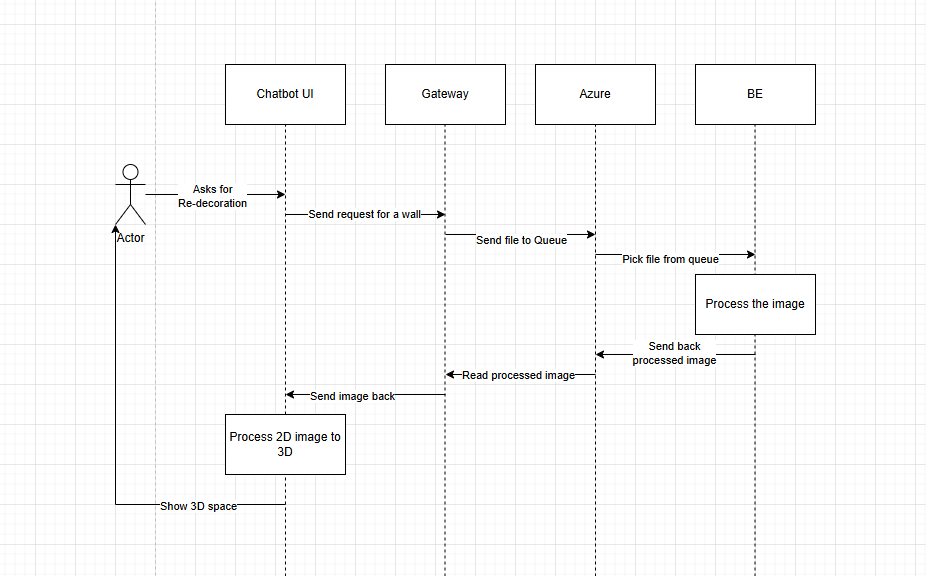

# LLD

# pip list
Package                   Version
------------------------- ----------------
absl-py                   2.1.0
accelerate                1.5.1
anyio                     4.4.0
argon2-cffi               23.1.0
argon2-cffi-bindings      21.2.0
arrow                     1.3.0
asttokens                 2.4.1
astunparse                1.6.3
async-lru                 2.0.4
asyncio                   3.4.3
attrs                     24.2.0
awscli                    1.35.15
azure-core                1.32.0
azure-storage-blob        12.24.0
babel                     2.16.0
beautifulsoup4            4.12.3
bleach                    6.1.0
blinker                   1.7.0
boto3                     1.35.49
botocore                  1.35.49
certifi                   2024.2.2
cffi                      1.17.0
charset-normalizer        3.3.2
click                     8.1.7
colorama                  0.4.6
comm                      0.2.2
contourpy                 1.2.0
cryptography              44.0.0
cycler                    0.12.1
debugpy                   1.8.5
decorator                 5.1.1
defusedxml                0.7.1
diffusers                 0.32.2
dm-tree                   0.1.8
docker                    7.1.0
docstring_parser          0.16
docutils                  0.16
etils                     1.10.0
executing                 2.0.1
fastjsonschema            2.20.0
filelock                  3.16.1
Flask                     3.0.3
flatbuffers               24.3.25
fonttools                 4.49.0
fqdn                      1.5.1
fsspec                    2024.10.0
gast                      0.5.4
gitdb                     4.0.11
GitPython                 3.1.43
google-pasta              0.2.0
googleapis-common-protos  1.65.0
grpcio                    1.62.1
h11                       0.14.0
h5py                      3.12.1
httpcore                  1.0.5
httpx                     0.27.2
huggingface-hub           0.29.3
idna                      3.6
immutabledict             4.2.0
importlib_metadata        8.6.1
importlib_resources       6.4.5
ipykernel                 6.29.5
ipython                   8.27.0
ipywidgets                8.1.5
isodate                   0.7.2
isoduration               20.11.0
itsdangerous              2.1.2
jaraco.classes            3.4.0
jaraco.context            6.0.1
jax                       0.4.35
jaxlib                    0.4.35
jedi                      0.19.1
Jinja2                    3.1.3
jmespath                  1.0.1
joblib                    1.3.2
json5                     0.9.25
jsonpointer               3.0.0
jsonschema                4.23.0
jsonschema-specifications 2023.12.1
jupyter                   1.1.1
jupyter_client            8.6.2
jupyter-console           6.6.3
jupyter_core              5.7.2
jupyter-events            0.10.0
jupyter-lsp               2.2.5
jupyter_server            2.14.2
jupyter_server_terminals  0.5.3
jupyterlab                4.2.5
jupyterlab_pygments       0.3.0
jupyterlab_server         2.27.3
jupyterlab_widgets        3.0.13
kagglehub                 0.3.3
keras                     3.6.0
keras-core                0.1.7
keras-cv                  0.9.0
keyring                   8.7
keyrings.alt              5.0.2
kiwisolver                1.4.5
labelImg                  1.8.6
lapx                      0.5.11.post1
libclang                  16.0.6
lxml                      5.3.0
Markdown                  3.5.2
markdown-it-py            3.0.0
MarkupSafe                2.1.5
matplotlib                3.8.3
matplotlib-inline         0.1.7
mdurl                     0.1.2
mediapipe                 0.10.21
mistune                   3.0.2
ml-dtypes                 0.4.1
more-itertools            10.5.0
mpmath                    1.3.0
namex                     0.0.7
nbclient                  0.10.0
nbconvert                 7.16.4
nbformat                  5.10.4
nest-asyncio              1.6.0
networkx                  3.4.2
notebook                  7.2.2
notebook_shim             0.2.4
numpy                     1.26.4
opencv-contrib-python     4.11.0.86
opencv-python             4.10.0.84
opt-einsum                3.3.0
optree                    0.13.0
overrides                 7.7.0
packaging                 24.0
pandas                    2.2.1
pandocfilters             1.5.1
parso                     0.8.4
pillow                    11.0.0
pip                       25.1
platformdirs              4.2.2
prometheus_client         0.20.0
promise                   2.3
prompt_toolkit            3.0.47
protobuf                  4.25.3
psutil                    6.0.0
pure_eval                 0.2.3
py-cpuinfo                9.0.0
pyarrow                   18.0.0
pyasn1                    0.6.1
pycparser                 2.22
Pygments                  2.17.2
pyparsing                 3.1.2
PyQt5                     5.15.11
PyQt5-Qt5                 5.15.2
PyQt5_sip                 12.15.0
python-dateutil           2.9.0.post0
python-json-logger        2.0.7
pytz                      2024.1
pywin32                   306
pywin32-ctypes            0.2.3
pywinpty                  2.0.13
PyYAML                    6.0.2
pyzmq                     26.2.0
referencing               0.35.1
regex                     2024.9.11
requests                  2.32.3
rfc3339-validator         0.1.4
rfc3986-validator         0.1.1
rich                      13.7.1
rpds-py                   0.20.0
rsa                       4.7.2
ruamel.yaml               0.18.6
ruamel.yaml.clib          0.2.12
s3transfer                0.10.3
safetensors               0.5.3
scikit-learn              1.4.1.post1
scipy                     1.12.0
seaborn                   0.13.2
Send2Trash                1.8.3
sentencepiece             0.2.0
setuptools                76.0.0
simple-parsing            0.1.6
six                       1.16.0
smmap                     5.0.1
sniffio                   1.3.1
sounddevice               0.5.1
soupsieve                 2.6
stack-data                0.6.3
sympy                     1.13.3
tabulate                  0.9.0
tensorboard               2.18.0
tensorboard-data-server   0.7.2
tensorflow                2.18.0
tensorflow-datasets       4.8.3
tensorflow_intel          2.18.0
tensorflow-metadata       1.16.1
termcolor                 2.4.0
terminado                 0.18.1
thop                      0.1.1-2209072238
threadpoolctl             3.3.0
tinycss2                  1.3.0
tokenizers                0.21.1
toml                      0.10.2
torch                     2.7.0+cu118
torchaudio                2.7.0+cu118
torchvision               0.22.0+cu118
tornado                   6.4.1
tqdm                      4.66.5
traitlets                 5.14.3
transformers              4.49.0
types-python-dateutil     2.9.0.20240821
typing_extensions         4.10.0
tzdata                    2024.1
ultralytics               8.3.23
ultralytics-thop          2.0.9
uri-template              1.3.0
urllib3                   2.2.1
voluptuous                0.15.2
wcwidth                   0.2.13
webcolors                 24.8.0
webencodings              0.5.1
websocket-client          1.8.0
websockets                12.0
Werkzeug                  3.0.1
wheel                     0.45.1
widgetsnbextension        4.0.13
wrapt                     1.16.0
yolo                      0.3.1
zipp                      3.20.2